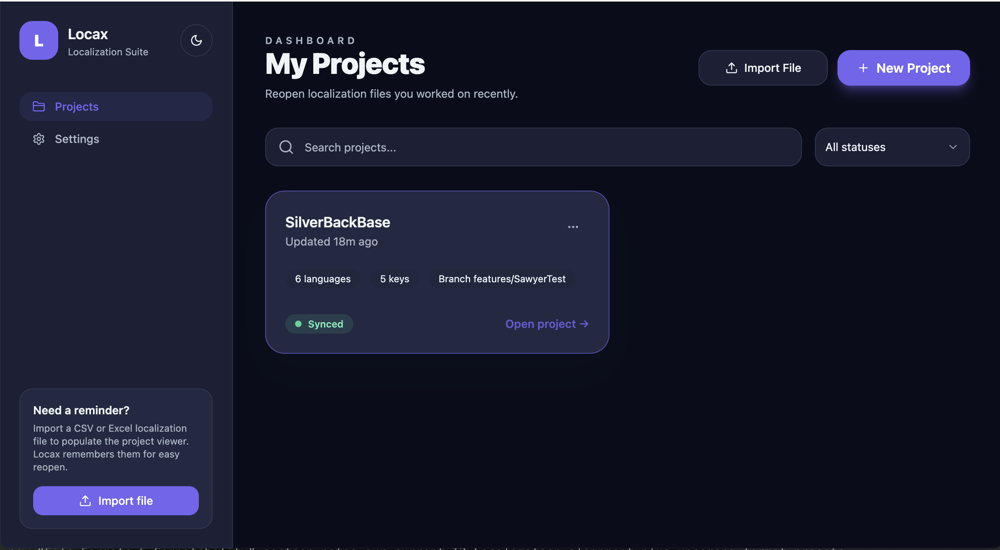
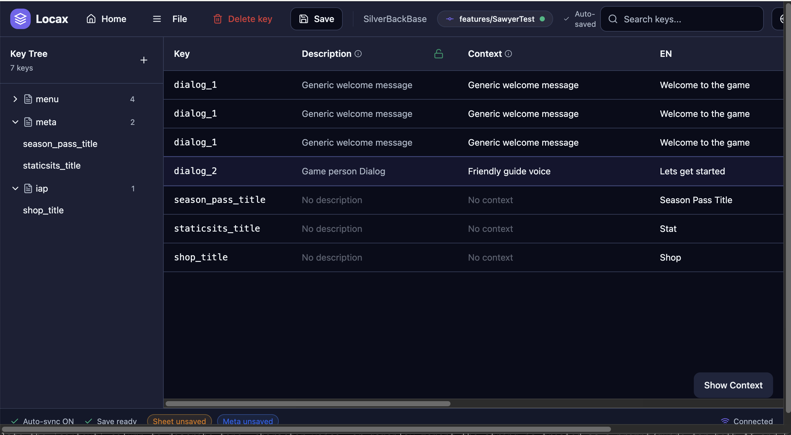

# Locax – Local-First Localization Studio

Locax is an open-source dashboard for editing game/app localization files, syncing context, and optionally boosting translations with your own AI keys or local models. It runs entirely on your machine (browser or Electron desktop), so CSV/XLSX files never leave your project folder.

-## Highlights
- **Local-first editing** – Mount a folder, detect CSV/XLSX sheets, edit keys inline, attach screenshots, and save directly to disk.
- **Spreadsheet parity** – Keep descriptions, types, and category hierarchies intact while auto-saving row changes and language columns.
- **Feature-level organization** – Huge localization sheets stay manageable thanks to the category tree; prefix keys (e.g., `inventory:open_button`) to group by feature and filter thousands of rows instantly.
- **Context-aware prompts** – Use the dedicated `context` column as a natural-language brief that informs AI translations, plus attach screenshots so human translators and models understand scene tone.
- **Context tools** – Link screenshots across keys, add notes, and see Git branch info so translators stay in sync with source control.
- **Bring-your-own AI** – Plug in OpenAI, Google Gemini, or OpenRouter keys, or route to local providers (Ollama models + Meta’s M2M100) for offline translations.
- **Desktop + Web** – Develop with Vite/React, ship installers via Electron Builder, or access via the browser using the File System Access API.

## Requirements
- Node.js 20+ and npm
- Git
- (Optional) Python 3.10+ for the M2M100 FastAPI service
- (Optional) Ollama 0.1.36+ for other local LLMs

## Quick Start
```bash
git clone https://github.com/<you>/locax.git
cd locax
npm install
npm run dev        # browser (http://localhost:5173)
npm run dev:desktop  # Vite + Electron live reload
```

Build production bundles:
```bash
npm run build        # renderer only
npm run desktop      # smoke Electron build locally
npm run dist:mac     # macOS installer (see also dist:win / dist:linux)
```

## Using Locax
1. Launch the app (`npm run dev` or `npm run dev:desktop`).
2. Pick **Try Sample Project** to explore the UI, or use the unified picker to select your localization sheet (CSV/XLSX). After choosing the file, Locax asks for the parent folder (typically your Git repo root) so it can persist screenshots and meta files alongside your code.
3. Locax scans for CSV/XLSX files, mirrors their columns, and shows them in a tree by category/feature. Use key prefixes such as `feature-name:key-id` to keep massive sheets organized—filtering by feature collapses thousands of rows into a focused view. Click rows to edit, double-click cells to change translations, and attach screenshots from the right panel.
4. Populate the `context` column to describe tone, character voice, or gameplay moment—the string is treated as a prompt/guide for both AI and human translators. Add screenshots for visual cues; multiple keys can point to the same image.
5. Changes auto-save directly to your local files; no additional servers or cloud storage are involved. The tool respects your project’s Git history—you can commit edited spreadsheets and screenshots like any other asset.

### Sneak Peek

*Browse thousands of keys by feature, edit inline, and monitor auto-save status.*


*Attach screenshots, add context prompts, and trigger AI translations from the side panel.*

## File Formats & Compatibility
- CSV/XLSX layout mirrors the popular [I2 Localization](https://assetstore.unity.com/packages/tools/localization/i2-localization-14884?srsltid=AfmBOoqZ75vWuzbiIg1ZtWo6JwAPWIHBqJzZpT-AS3l7lY9zO8PSNQmv) workflow used in many Unity projects (columns like `Key`, `Type`, `Desc`, `context`, per-language codes).
- Future releases will add presets for other toolchains (Godot localization sheets, Unreal PO, custom CSV headers). Drop an issue or PR if your format should be next—we’re designing the parser to be extensible.

## AI Providers
- **OpenAI** – paste your `sk-...` key.
- **Google Gemini** – paste a Generative Language API key (`AIza...`).
- **OpenRouter** – add your API key plus a model ID (e.g., `google/gemini-flash-1.5`).
- **Ollama (Local)** – ensure `ollama serve` is running, download a model (`ollama pull qwen2:7b`), then pick it in **Connect AI**.
- **M2M100 (Local)** – run Meta’s `facebook/m2m100_418M` offline service (instructions below).

Switch providers via **Connect AI** (top-right). API keys, endpoints, and model picks are stored locally per provider.

## Local Models
### Ollama
1. Install from [ollama.com](https://ollama.com/).
2. Run `ollama serve` and pull at least one model (`ollama pull mistral`).
3. In Locax, select **Ollama (Local)**, point to the endpoint (default `http://127.0.0.1:11434`), and choose the downloaded model.

### Meta M2M100
M2M100 is an encoder–decoder translation model covering 201 languages. Run it locally with FastAPI:

1. **Set up Python env**
   ```bash
   python3 -m venv .venv-m2m100
   source .venv-m2m100/bin/activate
   pip install -r server/requirements-m2m100.txt
   ```
2. **Download weights**
   ```bash
   npm run m2m100:download          # wraps python scripts/m2m100/fetch.py
   ```
   (Set `HF_TOKEN` if the Hugging Face repo requires auth.)
3. **Serve the model**
   ```bash
   npm run m2m100:serve             # starts FastAPI on http://127.0.0.1:9600
   ```
4. **Connect in Locax** – choose **M2M100 (Local)**, keep the default endpoint (`http://127.0.0.1:9600`), and save. Translations now route through the local service.

Need a one-command workflow? Use the helper script:
```bash
chmod +x scripts/run_with_m2m100.sh
./scripts/run_with_m2m100.sh "npm run dev:desktop"
```
It checks `/health` on port 9600, starts the FastAPI server if needed (logs under `~/.locax/logs/m2m100_service.log`), then launches the command you pass (defaults to `npm run dev`).

See [docs/m2m100_local_setup.md](docs/m2m100_local_setup.md) for deeper troubleshooting (venv tips, int8/FP16 selection, etc.).

## What's Next
- **More open-source models** – M2M100 is the first fully offline option; a fine-tuned model focused on mobile-game tone is in development, and we plan to keep adding community-friendly checkpoints.
- **Format presets** – Beyond I2-style spreadsheets, expect dedicated importers for other engines and localization SaaS exports.
- **Community vibes** – This tool started as a “vibe-coded” experiment and remains intentionally hackable. Fork it, wire up new providers, or open feature requests—the more translators it helps, the better.

## Folder Layout
- `src/` – React + TypeScript UI (components, pages, hooks, lib utilities).
- `electron/` – Electron main process entry.
- `docs/` – Contributor guides and AI setup notes.
- `scripts/` – Automation (model fetchers, helper launchers).
- `server/` – FastAPI runtime for local models.
- `public/` – Static assets.
- `dist/` – Build output (safe to delete).

## Contributing
- Follow the guidelines in [AGENTS.md](AGENTS.md) for style, testing, and PR expectations.
- Run `npm run lint` before submitting changes.
- Document any new AI providers or model manifests under `docs/` and `models/`.

Happy localizing! If you run into issues, file a GitHub issue with logs (`~/.locax/logs/m2m100_service.log` for the local service, console output for Ollama) and the commands you executed.
